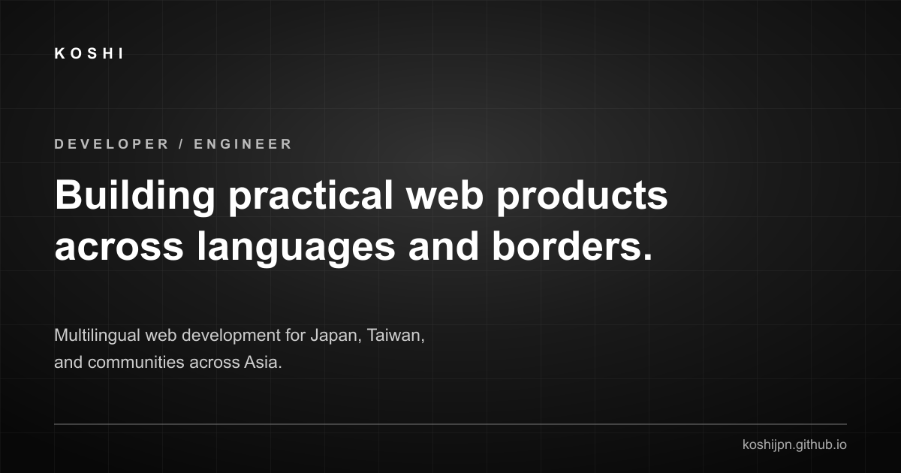

# Koshi Developer Portfolio

[](https://koshijpn.github.io/)
[](https://koshijpn.github.io/)
[](./LICENSE.md)

Developer portfolio for **Koshi Sugawara (菅原 鴻志)** — Web Developer specializing in **multilingual web development**, **JavaScript/React**, **WordPress**, **AI-assisted workflows**, and **SEO**.

### 🔗 Quick Links & Brand Ecosystem

- 🌐 **Live Demo / Portfolio**: [https://koshijpn.github.io/](https://koshijpn.github.io/)
- 👨‍💻 **GitHub Profile**: [https://github.com/koshijpn](https://github.com/koshijpn)
- 💼 **Commercial Services (SLEEP LATE LAB)**: [https://sleeplatelab.com/](https://sleeplatelab.com/)
- 👤 **Personal Profile & Works**: [https://koshijpn.com/](https://koshijpn.com/)
- 👔 **LinkedIn**: [https://www.linkedin.com/in/koshi-sugawara](https://www.linkedin.com/in/koshi-sugawara)



---

## 🚀 Quick Overview

- **What is this?**: The official developer portfolio and technical showcase for Koshi Sugawara.
- **What can Koshi build?**: Multilingual static & dynamic web applications, custom WordPress themes/plugins, REST APIs, AI-assisted automation, and performance/SEO optimizations.
- **Where to view live works?**: Access case studies and live demos directly at [koshijpn.github.io](https://koshijpn.github.io/).

---

## ⭐ Featured Projects

1. **[Developer Portfolio](https://koshijpn.github.io/projects/portfolio/)** — Multilingual static web app with zero-build setup, GitHub API integration, static SEO, and fallback resilience.
2. **[Next Jobs UI Prototype](https://koshijpn.github.io/projects/next-jobs/)** — Full-stack job search interface built with Svelte and REST APIs.
3. **[Next E-Commerce Prototype](https://koshijpn.github.io/projects/next-ecomm/)** — Decoupled frontend/backend e-commerce prototype.
4. **[Vouvray Huguet](https://koshijpn.github.io/projects/vouvray-huguet/)** — Multilingual English/French WordPress & WooCommerce store.

---

## 🛠️ Architecture & Tech Stack

- **Frontend**: Semantic HTML5, CSS3 (Flexbox/Grid, CSS Variables), Vanilla JavaScript (ES6+).
- **APIs & Dynamic Data**: GitHub REST API with offline JSON fallback data layer.
- **Localization**: Multi-language support (8 languages UI strings & content).
- **Hosting & Infra**: GitHub Pages (`main` branch root deployment).
- **SEO & Data**: Schema.org JSON-LD (Person, WebSite, SoftwareSourceCode), Open Graph, Twitter Cards, Canonical URLs.
- **Analytics & Tracking**: Google Tag Manager (`GTM-T6BQ47G3`), GA4 (`G-ZKZNCJZ6DF`), Microsoft Clarity (`xy6zsg56uc`).

No framework, package installation, or build step is required to run or deploy.

---

## ⚡ Quality Targets

- **Performance**: 90+ Lighthouse Target
- **Accessibility**: 95+ (Semantic headings, keyboard traps avoided, skip links, aria-labels)
- **Best Practices**: 95+ (CSP allowlists, no inline event handlers, HTTPS enforcement)
- **SEO**: 95+ (Page-unique titles, descriptions, canonicals, JSON-LD, sitemap XML)

---

## Structure

- `index.html` — main portfolio
- `projects.html` and `projects/` — project catalogue and case studies
- `articles/` — technical writing
- `profile.html` — supporting education and credentials
- `js/projects.js` — curated project and skill data
- `js/career.js` — time-sensitive education data
- `js/i18n.js`, `js/i18n-full.js` — translations
- `js/github.js` — public GitHub activity and fallback UI
- `css/style.css` — shared responsive design

## Development

Serve the repository root with any static web server. For example:

```sh
python3 -m http.server 8000
```

Then open `http://localhost:8000/`. Opening the HTML file directly also works, but a local server provides more realistic CSP and API behavior.

## Deployment

GitHub Pages publishes the `main` branch from the repository root. Keep relative URLs and the build-free structure intact.

## Analytics

The shared `js/main.js` initializes the same analytics stack on every page:

- Google Tag Manager: `GTM-T6BQ47G3` for the event/data-layer foundation
- Google Analytics 4: `G-ZKZNCJZ6DF`, loaded once by `js/main.js`
- Microsoft Clarity: `xy6zsg56uc`, loaded once by `js/main.js`

Browser verification confirms that the published GTM container currently loads neither GA4 nor Clarity. Both services are therefore initialized once by `js/main.js` with duplicate guards. If either service is later added to GTM, remove its direct loader from `js/main.js` before publishing the GTM tag.

Google Search Console ownership can be verified with the existing GTM or GA4 installation; Search Console does not require a visitor-tracking script on every page. Stable click events include:

- `project_click`
- `github_click`
- `linkedin_click`
- `commercial_services_click`

## Security

- No API keys or GitHub tokens are required.
- GitHub API requests use public endpoints only.
- External links opened in a new tab use `noopener noreferrer`.
- CSP uses an allowlist and does not permit `unsafe-eval`.
- Report vulnerabilities according to [SECURITY.md](./SECURITY.md).
